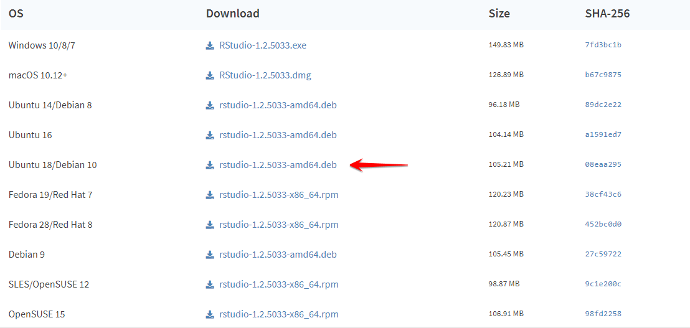
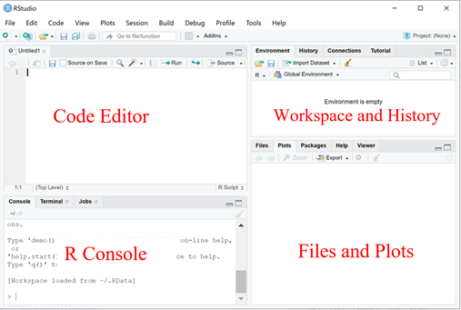

--- 
title: " "


link-citations: yes
description: "This is an introduction of R."
output:
  html_document
---

# Introduction to R

Xiunan Fang, Gordon Qian, Xinyi Lin, Ian Lee, Joshua Ho

Last update: 2021-06-26

Contact: jwkho@hku.hk


# Prerequisite
## Installation
The installation instruction is adapted based on CRAN's R [installation](https://cran.r-project.org/doc/manuals/r-patched/R-admin.html) guide and a DataCamp tutorial on ['How to install R on Windows, Mac OS X, and Ubuntu'](https://www.datacamp.com/community/tutorials/installing-R-windows-mac-ubuntu). 


### Windows 
**To Install R** 

- Open an internet browser and go to https://cran.r-project.org/.
- Click the "download R" link in the middle of the page under "Getting Started."
- Select a CRAN location (a mirror site) and click the corresponding link.
- Click on the "Download R for Windows" link at the top of the page.
- Choose the "base" and then Click on the "Download R 4.1.0 for Windows" link at the top of the page.
- Once the download is finished, you will obtain a file named "R-4.1.0-win.exe" or similar depending on the version of R that you download.
- Most of the time, you will likely want to go with the defaults, so click the button 'Next' until the process is complete.
- Now that R is installed, you need to download and install RStudio.

**To Install RStudio**

- Go to www.rstudio.com and click on the "Download RStudio" button.
- Click on "Download RStudio Desktop."
- The installation process is very straightforward as the gif below.

```{r fig1, echo=FALSE, message=FALSE, warning=FALSE}

```

### Mac OSX
**To Install R**

- Open an internet browser and go to www.r-project.org.
- Click the "download R" link in the middle of the page under "Getting Started."
- Select a CRAN location (a mirror site) and click the corresponding link.
- Click on the "Download R for (Mac) OS X" link at the top of the page.
- Click on the file containing the latest version of R under "Files."
- Save the ``.pkg`` file, double-click it to open, and follow the installation instructions.
- Now that R is installed, you need to download and install RStudio.

**To Install RStudio**
Very similar with Windows,

- Go to www.rstudio.com and click on the "Download RStudio" button.
- Click on "Download RStudio Desktop."
- Click on the version recommended for your system, or the latest Mac version, save the ``.dmg`` file on your computer, double-click it to open, and then drag and drop it to your applications folder.
```{r fig2, echo=FALSE, message=FALSE, warning=FALSE}
knitr::include_graphics("./images/mac_rs.png")
```

### Ubuntu

**To Install R**

As it is common, prior to installing R, let us update the system package index and upgrade all our installed packages using the following two commands:
```
sudo apt update
sudo apt -y upgrade
```
After that, all that you have to do is run the following in the command line to install base R.
```
sudo apt -y install r-base
```

**To Install RStudio**

Once base R is installed, you can go ahead and install RStudio. For that we are going to head over again to the RStudio downloads page and download the ``.deb`` file for our Ubuntu version as shown in the image below:
```{r fig3, echo=FALSE, message=FALSE, warning=FALSE}

```

## Use R inside RStudio
### R studio 
RStudio is very powerful for providing a a four pane work-spaces.

Top-left panel: Your scripts of the R codes, script is good to keep a record of your work and also convenient for command execution.

You can create a new script by:

`` File –> New –> R Script``

Bottom-left panel: R console for R commands, where you actually run the R codes.

Top-right panel:
Workspace tab: All the data(more specifically, R objects) you have created in the ``Workspace`` and all previous commands you previously ran in the ``History``.

Bottom-right panel:

Files in your working directory(you probably should also set your working directory) in ``Files``, and the plots you have created in ``Plots``.

```{r fig4, echo=FALSE, message=FALSE, warning=FALSE}

```

### Set working directory
-  Create a folder named “R-workshop” in your preferred directory
-  Create a "Data" folder in the "R-workshop" 
-  Download the data from the GitHub:
  [holab-hku.github.io/R-prework/data/](https://github.com/holab-hku/holab-hku.github.io/tree/master/R-prework/data)
for this workshop and extract the data in the "Data" folder
-  From RStudio, use the menu to change your working directory under 
``Session > Set Working Directory > Choose Directory``
-  Choose the directory to “R-workshop”

```{r fig5, echo=FALSE, message=FALSE, warning=FALSE}
knitr::include_graphics("./images/directory.png")
```

Or you can type in the console:
```
setwd("/yourdirectory/R-workshop")
```
For Windows, the command might look like :
```
setwd("c:/yourdirectory/R-workshop")
```

### Install packages
There are two packages used in this workshop, in the R console, type:
```
install.packages('ggplot2')
install.packages('gplots')
```


# Data structure in R
Understanding R data structure is very important. Basic data structures in R include *Vector*, *Matrix*, *Data Frame*, *Factor* and *List*. By learning this Chapter you will understand how to work with the right data structure you might need. 


## Vector

Vectors are a fundamental concept in R, and many functions in R returns results as vectors.
A vector is a one-dimensional array of values, the value can be ``character``, ``logical``, ``integer`` or ``numeric``.

HINT: YOU can get the documentation of a function using ``?`` or ``help`` . E.g `?rep` or ``help(rep)``

TRY:
```{r, results='hide'}
x <- rep(1,3)
```
```{r, results='hide'}
y <- 1:3
```
```{r, results='hide'}
z <- c(1,2,3)
```
c()is the function to combine values, try the two following commands:

```{r, results='hide'}
c(x,y)
```
```{r, results='hide'}
x+y
```

**Quiz**
```
1. What is the difference of c(a,b) and a+b
2. Create a vector with "R" "is" "fun"
HINT: use c()
```
A new vector can be created by splicing an existing vector with a numerical indexes. We can use the indexes yo slice the vector. To slice between two indexes, we can use the colon operator ``:`` .
Here is an example of create a vector with students marks.
```{r, results='hide'}
marks <- c(50, 100, 90, 80, 70) 
student_names <- c("Amy","Bobby","Cindy","Eddy","Dylon")
```
```{r, results='hide'}
names(marks) <- student_names
```
```{r, results='hide'}
marks[c(2:4)] 
```
```{r, results='hide'}
marks[c("Bobby","Cindy")] 
```
**Quiz**
```
1. Get the highest mark amongst Amy, Cindy, Dylon
HINT: use max()
```

## Matrix

Matrix is a two dimensional data structure in R programming. Matrix is a two-dimensional vector. Same as a vector, all value in a matrix should be of the same type. And all columns should be the same length.

HINT: dimension can be checked with ``dim()`` 

### Make a matrix
You can simply make a matrxi like this:
```{r, results='hide'}
m <- matrix(1:15, nrow = 3, ncol = 5)
```
You can change the column names and row names:
```{r, results='hide'}
#Change names
colnames(m) <- c("A","B","C","D","E")
rownames(m) <- c("X","Y","Z")
```
You can also make a matrix by ``cbind()`` and ``rbind()``  to bind columns or rows.
```{r, results='hide'}
cbind(c(1:9),c(11:19))
rbind(c(1:9),c(11:19))
```
We can also bind a column or row to the existing matrix.
```{r, results='hide'}
cbind(m,c(16,17,18))
rbind(m,c(20,21,22,23,24))
```
The value in a matrix can be be accessed as [row_index, column_index]. 
```{r, results='hide'}
m <- matrix(1:15, nrow = 3, ncol = 5)
# select rows 1 & 2 and columns 1 & 2
m[c(1,2),c(1,2)] 
# select all columns
m[c(1,2),] 
```

``which()`` function returns the true indices of a logical object, try:
```{r, results='hide'}
which.min(m)
which.max(m)
which(m == 7)
```
### Modify a matrix 
Assign a value, ``<-`` and ``=`` do the same work
```
<-         assignment (right to left)
=          assignment (right to left)
```
Assign all elements less than 5 to 0
```{r, results='hide'}
m[m<5] <- 0
```
You can transpose a matrix by ``t()``
```{r, results='hide'}
t(m)
```
Remove last row
```{r, results='hide'}
m <- m[-3,]
# or
m <- m[-nrow(m),]
```


## DataFrame 

Data frame is a two dimensional data structure in R. It is similar with matrix, but you can have different data types for elements in a data frame.
```{r, results='hide'}
x <- data.frame("SID" = 1:3, "Age" = c(23,25,21), "Name" = c("Amy","Bobby","Cindy"), "Mark" = c(100,82,75))
```
Use ``[``  will return us a data frame.
TRY:
```{r, results='hide'}
x["Name"]
```
Accessing with ``[[`` or ``$`` is similar. They will return the result as a vector.
```{r, results='hide'}
x[["Name"]]
x$Name
```
Select students with mark greater than 80 and make a new list called x_highmark.

```{r, results='hide'}
x_highmark <- x[x$Mark>80,]
```

**Quiz**
```
1.Select Students with mark greater than 80 and get the average age of them.
HINT: use mean()
```

## Factor
Factors are variables in R for categorical variables.
```{r}
category = c(0,1,1,1,1,2,2,2,1,2,1,1,1)
fdata = factor(category)
fdata
```
Or you can factor the vector with specific names.
```{r}
fdata1 = factor(category,labels=c("A","B","C"))
fdata1
```
You can not treat the values in factors as numerical data, for example, if you use ``mean(fdata)`` you will get the warning as below.
```{r}
mean(fdata)
```
If we want to calculate the mean of the original numeric values of the fdata variable, we can use
```{r}
mean(as.numeric(fdata))
```
## List
List is a data structure having mixed data types. It is the most flexible data structure in R. 
Data frame is a special case of list.

We can check the data type with ``typeof()`` function and find the length using ``length()``, we can use ``str()`` to find the data structure.     
```{r, results='hide'}
x <- list("a" = 1000, "b" = TRUE, "c" = 1:3)
typeof(x)
length
str(x)
```

# Data manipulation
## apply functions
This chapter is adapted based on the tutorial ["apply(), lapply(), sapply(), tapply() Function in R with Examples"](https://www.guru99.com/r-apply-sapply-tapply.html)  and [RDocumentation apply functions](https://www.rdocumentation.org/packages/base/versions/3.6.2/topics/apply).

### apply()
``apply()`` takes Data frame or matrix as an input and gives output in vector, list or array. Apply function is used for matrix, it is designed to avoid explicit uses of loop constructs. 

```
apply(X, MARGIN, FUN)
Here:
-x: an array or matrix
-MARGIN:  take a value or range between 1 and 2 to define where to apply the function:
-MARGIN=1: the manipulation is performed on rows
-MARGIN=2: the manipulation is performed on columns
-MARGIN=c(1,2) the manipulation is performed on rows and columns
-FUN: tells which function to apply. Built functions like mean, median, sum, min, max and even user-defined functions can be applied>
```
Example1:
```{r, results='hide'}
m1 <- matrix(C<-(1:6),nrow=2, ncol=3)
m1
m1_colsum <- apply(m1, 2, sum)
m1_colsum 
```
If you want to perform the function in each cell, you can set the margin to ``1:2`` or c(1,2)

```{r, results='hide'}
apply(m1, 1:2, function(x) x+3)
```

Example2: a function to find standard error was created, then passed into an apply function to find the standard error of each column.
```{r, results='hide'}
m2 <- matrix(c(1:10, 11:20, 21:30), nrow = 10, ncol = 3)

st.err <- function(x){
  sd(x)/sqrt(length(x))
}

apply(m2, 2, st.err)
```

### lapply()
``lapply()`` in R takes list, vector or data frame as input and gives output in list.
```
lapply(X, FUN)
Arguments:
-X: A vector or an object
-FUN: Function applied to each element of x
```
Example:
```{r, results='hide'}
A<-c(1:9)
B<-c(1:12)
C<-c(1:15)
mylist<-list(A,B,C)
lapply(mylist, sum)
```
### sapply()
``sapply()`` works just like lapply, but will simplify the output if possible. This means that instead of returning a list like lapply, it will return a vector instead.
Example:
```{r, results='hide'}
sapply(mylist, sum)
```
### tapply()
Apply a function to each cell of a ragged array, that is to each (non-empty) group of values given by a unique combination of the levels of certain factors.

Example1:
```{r, results='hide'}
tdata <- as.data.frame(cbind(c(1,1,1,1,1,2,2,2,2,2), m2))
tapply(tdata$V2, tdata$V1, mean)
```
Example2:
```{r, results='hide'}
summary <- tapply(tdata$V2, tdata$V1, function(x) c(mean(x), sd(x)))
```
##  Pattern matching
### Find strings
``grep(pattern, string)`` returns by default a vector of indices. 

``grepl(pattern, string)`` returns by default a vector of logical values. 
In ``grep()``, if you want to have the actual matching element values, set the option value to TRUE by value=TRUE. Pattern matching in R defaults to be case sensitive. You can use ignore.case = TRUE to avoid case sensitivivity.
```{r, results='hide'}
strings <- c("Abcd", "cdab", "ca bd")
grep("ab", strings)
grepl("ab", strings)
grep("ab", strings, value = FALSE)
grep("ab", strings, value = TRUE)
grep("ab", strings, value = TRUE,ignore.case = TRUE)

```
### Find and replace patterns

``gsub(pattern, replacement, string)`` returns the modified string after replacing every pattern occurrence with replacement in string.

```{r, results='hide'}
studentID <- c("u1000", "u1001", "u1002")
gsub("u", "U", studentID)

```

### Regular expression
The content in this chapter is adpted based on ["Regular Expressions in R"](https://rstudio-pubs-static.s3.amazonaws.com/74603_76cd14d5983f47408fdf0b323550b846.html) and CRAN documentation ["Regular expressions"](https://cran.r-project.org/web/packages/stringr/vignettes/regular-expressions.html). 

**Basic**
Quantifiers specify how many times that the preceding pattern should occur.

- `*` : matches at least 0 times.
- `+` : matches at least 1 times.
- `?` : matches at most 1 times.
- `{n}` : matches exactly n times.
- `{n,}` : matches at least n times.
- `{,m}` : matches at most m times.
- `{n,m}` : matches between n and m times.
```{r, results='hide'}
strings <- c("a", "ab", "acb", "accb", "acccb", "accccb")
grep("ac*b", strings, value = TRUE)
grep("ac+b", strings, value = TRUE)
grep("ac?b", strings, value = TRUE)
grep("ac{2}b", strings, value = TRUE)
grep("ac{2,}b", strings, value = TRUE)
grep("ac{2,3}b", strings, value = TRUE)
```
- `^` : Start of the string.
- `$` : End of the string.
- `\\<` : Beginning of a word
- `\\>` : End of a word
```{r, results='hide'}
strings <- c("abcd", "cdab", "cabd", "c abd", "abc","*ab")
grep("^ab", strings, value = TRUE)
grep("ab$", strings, value = TRUE)
grep("\\<a", strings, value = TRUE)
grep("c\\>", strings, value = TRUE)
```
- `.` : Any non-empty character

- `[...]` : a permitted character list. Use `-` inside the brackets to specify a range of characters.

- `[^...]` : an excluded character list. Match any characters except those inside the square brackets.

- `|` : an OR operator, matches patterns on either side of the |.

- `\`: Escape metacharacters in regular expression, i.e.
```
$ * + . ? [ ] ^ { } | ( ) \`
```
```{r, results='hide'}
strings <- c("^ab", "ab", "abc", "abd", " abc d", "abe", "ab 12")
grep("ab.", strings, value = TRUE)
grep("ab[c-e]", strings, value = TRUE)
grep("ab[^c]", strings, value = TRUE)
grep("\\^ab", strings, value = TRUE)
grep("abc|abd", strings, value = TRUE)
```

**Advance**

- `[[:digit:]]` or `\\d` or `[0-9]` : digits 0 1 2 3 4 5 6 7 8 9
- `\\D` or `[^0-9]` : non-digits
- `[[:lower:]]` or `[a-z]` : lower-case letters

- `[[:upper:]]` or `[A-Z]` : upper-case letters

- `[[:alpha:]]` or `[A-z]` : alphabetic characters

- `[[:alnum:]]` or `[A-z0-9]` : alphanumeric characters

- `\\w` : word characters include alphanumeric characters `0-9,a-z,A-Z`, `-` and underscores `_`

- `\\W` : non-word characters

- `[[:blank:]]` : space and tab

- `[[:space:]]` or `\\s` : space characters: tab, newline, vertical tab, form feed, carriage return, space

- `\\S` : not space characters

- `[[:punct:]]` : punctuation characters

`! " # $ % & ' ( ) * + , - . / : ; < = > ? @ [  ] ^ _ ` { | } ~`

- `[[:cntrl:]]` or `\\c` : control characters, like ``\n`` or ``\r`` etc.

Regular expressions are a concise and flexible tool for describing patterns in strings. If you are interested, there are more examples in the tutorial provided by Cran.
https://cran.rstudio.com/web/packages/stringr/vignettes/regular-expressions.html

## Example

This exercise demonstrates how to use apply and tapply to summarize information from a table.
More information of apply functions can be found in *3.1*.

Using ``apply()`` to get the mean and sd on every column
```{r}
mtcars.mean <- apply(mtcars[,1:7], 2, mean)
mtcars.sd <- apply(mtcars[,1:7], 2, sd)
```
Using ``tapply()`` to get the maxmimum mpg per vs type
```{r}
mtcars.max.vs <- tapply(mtcars$mpg, mtcars$vs, max)
```
**Filtering**

Using ``grep()`` to select names with Merc
```{r}
mtcars[grep("Merc", rownames(mtcars)),]
```
combining ``tapply()`` and ``apply()``.
```{r}
apply(mtcars[,1:7],2,function(x) tapply(x, mtcars$gear, sum))
```
Using filter to select disp larger than 200.
```{r}
mtcars[mtcars$disp > 200,]
```

## Exercise

Load dataset mpg
```
library(ggplot2)
data("mpg")
```
***Quiz***

Q1 How  many different car manufacturers are present?
``Tip: Use functions: length() and unique()``

Q2 How many SUV's (class) does each car manufacturer have?
``Tip: Use table()``

Q3 Create a new data.table with only automatic transmission type (trans) and 4 cylinders (cyl)
``Tip: Use grepl()``

Q4 Create a new column called trans_subtype, with the transmission subtype information (the value inside the brackets)
``Tip: Use gsub``


Q5 For toyota's "toyota tacoma 4wd" model, rename them to only "tacoma 4wd"
``Tip: Try use gsub``


Q6 Create a new column called ID, with the first 3 characters of the manufacturer name capitalised with year of manufacturer separated by a _
``Tip: Use toupper() and substr() and paste0()
E.g. audi 1999 --> AUD_1999``


Q7 How many different model names have number(s) in their name for each manufacturer?
``Tips: Use table() and grepl()``

Q8 Find the average city mileage (cty) for each manufacturer type
``Tip: use sapply``

Q9 What is the average city mileage (cty) for models with number(s) in the name for each manufacturer?


Q10 Create a new data frame called mpg_summary with the following columns: 
- (A) Manufacturer name
- (B) number of different models for that manufacturer 
- (C) average displ
- (D) manufacturing range (e.g. 1999,2000,2003 --> 1999-2003)
- (E) average cyl
- (F) most frequent transmission type (if there is a tie, print out all separated by |)
- (G) least frequent drv (if there is a tie, print out all separated by |)
- (H) Max cty 
- (I) Min Hwy
- (J) All fuel types (fl). Separate by | (E.g. f,r,e --> "f|r|e")
- (K) Class with the longest name
- (L) Transition sub-type with the largest number (if there is tie, print out all separated by |)

``Tips: Use this to set up your new dataframe:``
```
mpg_summary <- data.frame(A=character(), B=character(), C=character(), D=character(), E=character(), F=character(), G=character(), H=character(),
I=character(), J=character(), K=character(), L=character())
```
Q11 Write a function that takes in a manufacturer name and print out the highway mileage (hwy) range for each car model


# Answers

**Answer for Exercise4.4**

```{r echo=TRUE}
library(ggplot2)
data("mpg")
```

A1 
```{r echo=TRUE}
length(unique(mpg$manufacturer))
```
A2
```{r echo=TRUE}
table(mpg[mpg$class=="suv","manufacturer"])
```
A3
```{r}
mpg[grepl("auto",mpg$trans)&mpg$cyl==4,]
```
A4
```{r}
mpg$trans_subtype <- gsub(".*\\((.*)\\)","\\1",mpg$trans)
```
A5
```{r}
mpg[mpg$model=="toyota tacoma 4wd","model"] <- "tacoma 4wd"
#or
mpg$model <- gsub("^toyota ", "",mpg$model)
```
A6
```{r}
mpg$ID <- paste0(toupper(substr(mpg$manufacturer,1,3)),"_",mpg$year)
```

A7
```{r}
table(mpg[grepl('\\d',mpg$model),"manufacturer"])
```
A8
```{r}
manufacturers <- unique(mpg$manufacturer)
sapply(manufacturers, function(x){
  mean(mpg[mpg$manufacturer==x,]$cty)
})
```
A9
```{r}
manufacturers <- unique(mpg$manufacturer)
sapply(manufacturers, function(x){
  x <- mean(mpg[mpg$manufacturer==x&grepl('\\d',mpg$model),]$cty)
  if(is.na(x)){0}else{x}
})
```
A10
```{r}
mpg_summary <- data.frame(A=character(), B=character(), C=character(), D=character(),
                          E=character(), F=character(), G=character(), H=character(),
                          I=character(), J=character(), K=character(), L=character())
for(x in unique(mpg$manufacturer)){
  subset <- mpg[mpg$manufacturer==x,]
  A <- x
  B <- length(unique(subset$model))
  C <- mean(subset$displ)
  D <- paste0(min(subset$year),"-",max(subset$year))
  E <- mean(subset$cyl)
  F <- paste(names(which(table(subset$trans)==max(table(subset$trans)))),collapse = "|")
  G <- paste(names(which(table(subset$trans)==min(table(subset$trans)))),collapse = "|")
  H <- max(subset$cty)
  I <- min(subset$hwy)
  J <- paste(unique(subset$fl),collapse = "|")
  K <- subset$class[which.max(nchar(subset$class))]

  largest_value <- max(gsub(".(\\d)","\\1",subset$trans_subtype[grepl("\\d",subset$trans_subtype)]))
  L <- paste(unique(subset$trans_subtype[grepl(largest_value,subset$trans_subtype)]), collapse = "|")
  mpg_summary[nrow(mpg_summary)+1,] <- c(A,B,C,D,E,F,G,H,I,J,K,L)
}
```
A11
```{r}
get_hwy_ranage <-function(x){
  lower <- min(mpg[mpg$manufacturer==x,"hwy"])
  upper <- max(mpg[mpg$manufacturer==x,"hwy"])
  print(paste0(lower,"-",upper))
}
```


