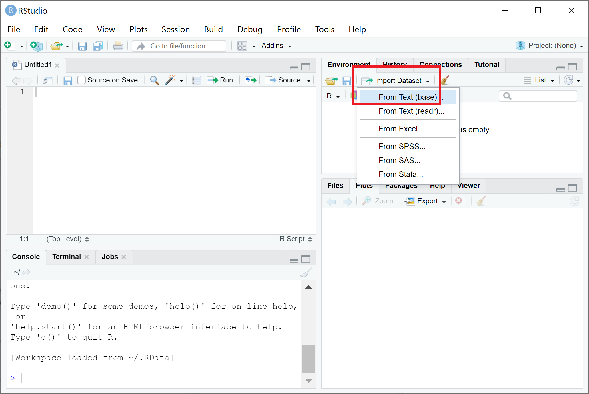

--- 
title: " "


link-citations: yes
description: "This is an introduction of R."
output:
  html_document
---

# Introduction to R

Xiunan Fang, Gordon Qian, Xinyi Lin, Ian Lee, Joshua Ho

Last update: 2021-06-26

Contact: jwkho@hku.hk


# Prerequisite
## Installation
The installation instruction is adapted based on CRAN's R [installation](https://cran.r-project.org/doc/manuals/r-patched/R-admin.html) guide and a DataCamp tutorial on ['How to install R on Windows, Mac OS X, and Ubuntu'](https://www.datacamp.com/community/tutorials/installing-R-windows-mac-ubuntu). 


### Windows 
**To Install R** 

- Open an internet browser and go to https://cran.r-project.org/.
- Click on the "Download R for Windows" link at the top of the page.
- Choose the "base" and then Click on the "Download R 4.1.0 for Windows" link at the top of the page.
- Once the download is finished, you will obtain a file named "R-4.1.0-win.exe" or similar depending on the version of R that you download.
- Most of the time, you will likely want to go with the defaults, so click the button 'Next' until the process is complete.
- Now that R is installed, you need to download and install RStudio.

**To Install RStudio**

- Go to www.rstudio.com and click on the "Download RStudio" button.
- Click on "Download RStudio Desktop."
- The installation process is very straightforward as the gif below.

```{r fig1, echo=FALSE, message=FALSE, warning=FALSE}
knitr::include_graphics("./images/windows_rs.gif")
```

### Mac OSX
**To Install R**

- Open an internet browser and go to https://cran.r-project.org/.
- Click on the "Download R for (Mac) OS X" link at the top of the page.
- Click on the file containing the latest version of R under "Files."
- Save the ``.pkg`` file, double-click it to open, and follow the installation instructions.
- Now that R is installed, you need to download and install RStudio.

**To Install RStudio**

Very similar with Windows,

- Go to www.rstudio.com and click on the "Download RStudio" button.
- Click on "Download RStudio Desktop."
- Click on the version recommended for your system, or the latest Mac version, save the ``.dmg`` file on your computer, double-click it to open, and then drag and drop it to your applications folder.
```{r fig2, echo=FALSE, message=FALSE, warning=FALSE}

```

### Ubuntu

**To Install R**

As it is common, prior to installing R, let us update the system package index and upgrade all our installed packages using the following two commands:
```
sudo apt update
sudo apt -y upgrade
```
After that, all that you have to do is run the following in the command line to install base R.
```
sudo apt -y install r-base
```

**To Install RStudio**

Once base R is installed, you can go ahead and install RStudio. For that we are going to head over again to the RStudio downloads page and download the ``.deb`` file for our Ubuntu version as shown in the image below:
```{r fig3, echo=FALSE, message=FALSE, warning=FALSE}
knitr::include_graphics("./images/ubuntu_rs.png")
```

## Use R inside RStudio
### R studio 
RStudio is very powerful for providing a a four pane work-spaces.

Top-left panel: Your scripts of the R codes, script is good to keep a record of your work and also convenient for command execution.

You can create a new script by:

`` File –> New –> R Script``

Bottom-left panel: R console for R commands, where you actually run the R codes.

Top-right panel:
Workspace tab: All the data(more specifically, R objects) you have created in the ``Workspace`` and all previous commands you previously ran in the ``History``.

Bottom-right panel:

Files in your working directory(you probably should also set your working directory) in ``Files``, and the plots you have created in ``Plots``.

```{r fig4, echo=FALSE, message=FALSE, warning=FALSE}
knitr::include_graphics("./images/rstudio.png")
```

### Set working directory
-  Create a folder named “R-workshop” in your preferred directory
-  Create a "Data" folder in the "R-workshop" 
-  Download the data from the GitHub:
  [holab-hku.github.io/R-workshop/data/](https://github.com/holab-hku/holab-hku.github.io/tree/master/R-prework/data) for this workshop and store the data in the "data" folder
-  From RStudio, use the menu to change your working directory under 
``Session > Set Working Directory > Choose Directory``
-  Choose the directory to “R-workshop”

```{r fig5, echo=FALSE, message=FALSE, warning=FALSE}
knitr::include_graphics("./images/directory.png")
```

Or you can type in the console:
```
setwd("/yourdirectory/R-workshop")
```
For Windows, the command might look like :
```
setwd("c:/yourdirectory/R-workshop")
```

### Some general knowledge
- R is case-sensitive
- Type enter to run R code in console pane 
- Ctrl-enter or Cmd-return if the code is in the scripts pane.
- Comments comes after # will not be treated as codes
- R has some pre-loaded data sets, to see the list of pre-loaded data, type ``data()``
- In R, a function is an object, a basic syntax of an R function looks like something below:
```
function_name <- function(arg_1, arg_2, ...) {
   actual function codes
}
```
For example:
```{r}
st.err <- function(x){
  sd(x)/sqrt(length(x))
}
```
R contains a lot of build-in functions, you can use ``?`` to see the documentation of a function, there are also a lot if external libraries with specific functions. To use a library, we do:
```
install.packages('package_name')
library(package_name)
```

### Install packages
There are several packages used in this workshop, in the R console, type:
```
install.packages('ggplot2')
install.packages('gplots')
install.packages('NMF')
install.packages('stats')
install.packages('ggfortify')
```

# Data structure in R

Understanding R data structure is very important. Basic data structures in R include *Vector*, *Matrix*, *Data Frame*, *Factor* and *List*. By learning this Chapter you will understand how to work with the right data structure you might need. 


## Vector

Vectors are a fundamental concept in R, and many functions in R returns results as vectors.
A vector is a one-dimensional array of values, the value can be ``character``, ``logical``, ``integer`` or ``numeric``. But a vector can only contain values of the same type.

HINT: YOU can get the documentation of a function using ``?`` or ``help`` . E.g `?rep` or ``help(rep)``

TRY:
```{r, results='hide'}
x <- rep(1,3)
```
```{r, results='hide'}
y <- 1:3
```
```{r, results='hide'}
z <- c(1,2,3)
```
c()is the function to combine values, try the two following commands:

```{r, results='hide'}
c(x,y)
```
```{r, results='hide'}
x+y
```

**Quiz**
```
1. What is the difference of c(a,b) and a+b
2. Create a vector with "R" "is" "fun"
HINT: use c()
```
A new vector can be created by splicing an existing vector with a numerical indexes. We can use the indexes yo slice the vector. To slice between two indexes, we can use the colon operator ``:`` .
Here is an example of create a vector with students marks. You can use ``names()`` to assign the names for values inside the vector.
```{r, results='hide'}
marks <- c(50, 100, 90, 80, 70) 
student_names <- c("Amy","Bobby","Cindy","Eddy","Dylon")
```
```{r, results='hide'}
names(marks) <- student_names
```
```{r, results='hide'}
marks[c(2:4)] 
```
```{r, results='hide'}
marks[c("Bobby","Cindy")] 
```
**Quiz**
```
1. Get the highest mark amongst Amy, Cindy, Dylon
HINT: use max()
```

## Matrix

Matrix is a two dimensional data structure in R programming. Matrix is a two-dimensional vector. Same as a vector, all values in a matrix should be of the same type. And all columns should be the same length.


### Make a matrix
You can simply make a matrxi like this:
```{r, results='hide'}
m <- matrix(1:15, nrow = 3, ncol = 5)
```
You can change the column names and row names:
```{r, results='hide'}
#Change names
colnames(m) <- c("A","B","C","D","E")
rownames(m) <- c("X","Y","Z")
```
You can also make a matrix by ``cbind()`` and ``rbind()``  to bind columns or rows.
```{r, results='hide'}
cbind(c(1:9),c(11:19))
rbind(c(1:9),c(11:19))
```
We can also bind a column or row to the existing matrix.
```{r, results='hide'}
cbind(m,c(16,17,18))
rbind(m,c(20,21,22,23,24))
```
The value in a matrix can be be accessed as [row_index, column_index]. 
```{r, results='hide'}
m <- matrix(1:15, nrow = 3, ncol = 5)
# select rows 1 & 2 and columns 1 & 2
m[c(1,2),c(1,2)] 
# select all columns
m[c(1,2),] 
```

``which()`` function returns the true indices of a logical object, try:
```{r, results='hide'}
which.min(m)
which.max(m)
which(m == 7)
```
### Modify a matrix 
Assign a value, ``<-`` and ``=`` do the same work
```
<-         assignment (right to left)
=          assignment (right to left)
```
Assign all elements less than 5 to 0
```{r, results='hide'}
m[m<5] <- 0
```
You can transpose a matrix by ``t()``
```{r, results='hide'}
t(m)
```
Remove last row
```{r, results='hide'}
m <- m[-3,]
# or
m <- m[-nrow(m),]
```


## DataFrame 

Data frame is a two dimensional data structure in R. It is similar with matrix, but you can have different data types for elements in a data frame.
```{r, results='hide'}
x <- data.frame("SID" = 1:3, "Age" = c(23,25,21), "Name" = c("Amy","Bobby","Cindy"), "Mark" = c(100,82,75))
```
Use ``[``  will return us a data frame.
TRY:
```{r, results='hide'}
x["Name"]
```
Accessing with ``[[`` or ``$`` is similar. They will return the result as a vector.
```{r, results='hide'}
x[["Name"]]
x$Name
```
Select students with mark greater than 80 and make a new list called x_highmark.

```{r, results='hide'}
x_highmark <- x[x$Mark>80,]
```

**Quiz**
```
1.Select Students with mark greater than 80 and get the average age of them.
HINT: use mean()
```

## Factor
Factors are variables in R for categorical variables.
```{r}
category = c(0,1,1,1,1,2,2,2,1,2,1,1,1)
fdata = factor(category)
fdata
```
Or you can factor the vector with specific names.
```{r}
fdata1 = factor(category,labels=c("A","B","C"))
fdata1
```
You can not treat the values in factors as numerical data, for example, if you use ``mean(fdata)`` you will get the warning as below.
```{r}
mean(fdata)
```
If we want to calculate the mean of the original numeric values of the fdata variable, we can use
```{r}
mean(as.numeric(fdata))
```
## List
List is a data structure having mixed data types. It is the most flexible data structure in R. 
Data frame is a special case of list.

We can check the data type with ``typeof()`` function and find the length using ``length()``, we can use ``str()`` to find the data structure.     
```{r, results='hide'}
x <- list("a" = 1000, "b" = TRUE, "c" = 1:3)
typeof(x)
length(x)
str(x)
```

# Data manipulation
## apply functions
This chapter is adapted based on the tutorial ["apply(), lapply(), sapply(), tapply() Function in R with Examples"](https://www.guru99.com/r-apply-sapply-tapply.html)  and [RDocumentation apply functions](https://www.rdocumentation.org/packages/base/versions/3.6.2/topics/apply).

### apply()
``apply()`` takes Data frame or matrix as an input and gives output in vector, list or array. Apply function is used for matrix, it is designed to avoid explicit uses of loop constructs. 

```
apply(X, MARGIN, FUN)
Here:
-x: an array or matrix
-MARGIN:  take a value or range between 1 and 2 to define where to apply the function:
-MARGIN=1: the manipulation is performed on rows
-MARGIN=2: the manipulation is performed on columns
-MARGIN=c(1,2) the manipulation is performed on rows and columns
-FUN: tells which function to apply. Built functions like mean, median, sum, min, max and even user-defined functions can be applied>
```
Example1:
```{r, results='hide'}
m1 <- matrix(C<-(1:6),nrow=2, ncol=3)
m1
m1_colsum <- apply(m1, 2, sum)
m1_colsum 
```
If you want to perform the function in each cell, you can set the margin to ``1:2`` or c(1,2)

```{r, results='hide'}
apply(m1, 1:2, function(x) x+3)
```

Example2: a function to find standard error was created, then passed into an apply function to find the standard error of each column.
```{r, results='hide'}
m2 <- matrix(c(1:10, 11:20, 21:30), nrow = 10, ncol = 3)

st.err <- function(x){
  sd(x)/sqrt(length(x))
}

apply(m2, 2, st.err)
```

### lapply()
``lapply()`` in R takes list, vector or data frame as input and gives output in list.
```
lapply(X, FUN)
Arguments:
-X: A vector or an object
-FUN: Function applied to each element of x
```
Example:
```{r, results='hide'}
A<-c(1:9)
B<-c(1:12)
C<-c(1:15)
mylist<-list(A,B,C)
lapply(mylist, sum)
```
### sapply()
``sapply()`` works just like lapply, but will simplify the output if possible. This means that instead of returning a list like lapply, it will return a vector instead.
Example:
```{r, results='hide'}
sapply(mylist, sum)
```

### tapply()
Apply a function to each cell of a ragged array, that is to each (non-empty) group of values given by a unique combination of the levels of certain factors.

Example1:
```{r, results='hide'}
tdata <- as.data.frame(cbind(c(1,1,1,1,1,2,2,2,2,2), m2))
tapply(tdata$V2, tdata$V1, mean)
```
Example2:
```{r, results='hide'}
summary <- tapply(tdata$V2, tdata$V1, function(x) c(mean(x), sd(x)))
```

### mapply()
``mapply()`` is a multivariate version of ``sapply ()``, the syntax of mapply is a little bit different.
```
mapply(fun, arg1, arg2, arg3, …)
```
Example:
```{r, results='hide'}
mapply('*', 1:10, 5:14)
```

##  Pattern matching
### Find strings
``grep(pattern, string)`` returns by default a vector of indices. 

``grepl(pattern, string)`` returns by default a vector of logical values. 
In ``grep()``, if you want to have the actual matching element values, set the option value to TRUE by value=TRUE. Pattern matching in R defaults to be case sensitive. You can use ignore.case = TRUE to avoid case sensitivivity.
```{r, results='hide'}
strings <- c("Abcd", "cdab", "ca bd")
grep("ab", strings)
grepl("ab", strings)
grep("ab", strings, value = FALSE)
grep("ab", strings, value = TRUE)
grep("ab", strings, value = TRUE,ignore.case = TRUE)

```
### Find and replace patterns

``gsub(pattern, replacement, string)`` returns the modified string after replacing every pattern occurrence with replacement in string.

```{r, results='hide'}
studentID <- c("u1000", "u1001", "u1002")
gsub("u", "U", studentID)

```

### Regular expression
The content in this chapter is adpted based on ["Regular Expressions in R"](https://rstudio-pubs-static.s3.amazonaws.com/74603_76cd14d5983f47408fdf0b323550b846.html) and CRAN documentation ["Regular expressions"](https://cran.r-project.org/web/packages/stringr/vignettes/regular-expressions.html). 

**Basic**
Quantifiers specify how many times that the preceding pattern should occur.

- `*` : matches at least 0 times.
- `+` : matches at least 1 times.
- `?` : matches at most 1 times.
- `{n}` : matches exactly n times.
- `{n,}` : matches at least n times.
- `{,m}` : matches at most m times.
- `{n,m}` : matches between n and m times.
```{r, results='hide'}
strings <- c("a", "ab", "acb", "accb", "acccb", "accccb")
grep("ac*b", strings, value = TRUE)
grep("ac+b", strings, value = TRUE)
grep("ac?b", strings, value = TRUE)
grep("ac{2}b", strings, value = TRUE)
grep("ac{2,}b", strings, value = TRUE)
grep("ac{2,3}b", strings, value = TRUE)
```
- `^` : Start of the string.
- `$` : End of the string.
- `\\<` : Beginning of a word
- `\\>` : End of a word
```{r, results='hide'}
strings <- c("abcd", "cdab", "cabd", "c abd", "abc","*ab")
grep("^ab", strings, value = TRUE)
grep("ab$", strings, value = TRUE)
grep("\\<a", strings, value = TRUE)
grep("c\\>", strings, value = TRUE)
```
- `.` : Any non-empty character

- `[...]` : a permitted character list. Use `-` inside the brackets to specify a range of characters.

- `[^...]` : an excluded character list. Match any characters except those inside the square brackets.

- `|` : an OR operator, matches patterns on either side of the |.

- `\`: Escape metacharacters in regular expression, i.e.
```
$ * + . ? [ ] ^ { } | ( ) \`
```
```{r, results='hide'}
strings <- c("^ab", "ab", "abc", "abd", " abc d", "abe", "ab 12")
grep("ab.", strings, value = TRUE)
grep("ab[c-e]", strings, value = TRUE)
grep("ab[^c]", strings, value = TRUE)
grep("\\^ab", strings, value = TRUE)
grep("abc|abd", strings, value = TRUE)
```

**Advance**

- `[[:digit:]]` or `\\d` or `[0-9]` : digits 0 1 2 3 4 5 6 7 8 9
- `\\D` or `[^0-9]` : non-digits
- `[[:lower:]]` or `[a-z]` : lower-case letters

- `[[:upper:]]` or `[A-Z]` : upper-case letters

- `[[:alpha:]]` or `[A-z]` : alphabetic characters

- `[[:alnum:]]` or `[A-z0-9]` : alphanumeric characters

- `\\w` : word characters include alphanumeric characters `0-9,a-z,A-Z`, `-` and underscores `_`

- `\\W` : non-word characters

- `[[:blank:]]` : space and tab

- `[[:space:]]` or `\\s` : space characters: tab, newline, vertical tab, form feed, carriage return, space

- `\\S` : not space characters

- `[[:punct:]]` : punctuation characters

`! " # $ % & ' ( ) * + , - . / : ; < = > ? @ [  ] ^ _ ` { | } ~`

- `[[:cntrl:]]` or `\\c` : control characters, like ``\n`` or ``\r`` etc.

Regular expressions are a concise and flexible tool for describing patterns in strings. If you are interested, there are more examples in the tutorial provided by Cran.
https://cran.rstudio.com/web/packages/stringr/vignettes/regular-expressions.html

## Example

This exercise demonstrates how to use apply and tapply to summarize information from a table.
More information of apply functions can be found in *3.1*.

Using ``apply()`` to get the mean and sd on every column
```{r}
mtcars.mean <- apply(mtcars[,1:7], 2, mean)
mtcars.sd <- apply(mtcars[,1:7], 2, sd)
```
Using ``tapply()`` to get the maxmimum mpg per vs type
```{r}
mtcars.max.vs <- tapply(mtcars$mpg, mtcars$vs, max)
```
**Filtering**

Using ``grep()`` to select names with Merc
```{r}
mtcars[grep("Merc", rownames(mtcars)),]
```
combining ``tapply()`` and ``apply()``.
```{r}
apply(mtcars[,1:7],2,function(x) tapply(x, mtcars$gear, sum))
```
Using filter to select disp larger than 200.
```{r}
mtcars[mtcars$disp > 200,]
```

## Exercise

Load dataset mpg
```
library(ggplot2)
data("mpg")
```
***Quiz***

Q1 How  many different car manufacturers are present?
``Tip: Use functions: length() and unique()``

Q2 How many SUV's (class) does each car manufacturer have?
``Tip: Use table()``

Q3 Create a new data.table with only automatic transmission type (trans) and 4 cylinders (cyl)
``Tip: Use grepl()``

Q4 Create a new column called trans_subtype, with the transmission subtype information (the value inside the brackets)
``Tip: Use gsub``


Q5 For toyota's "toyota tacoma 4wd" model, rename them to only "tacoma 4wd"
``Tip: Try use gsub``


Q6 Create a new column called ID, with the first 3 characters of the manufacturer name capitalised with year of manufacturer separated by a _
``Tip: Use toupper() and substr() and paste0()
E.g. audi 1999 --> AUD_1999``


Q7 How many different model names have number(s) in their name for each manufacturer?
``Tips: Use table() and grepl()``

Q8 Find the average city mileage (cty) for each manufacturer type
``Tip: use sapply``

Q9 What is the average city mileage (cty) for models with number(s) in the name for each manufacturer?


Q10 Create a new data frame called mpg_summary with the following columns: 
- (A) Manufacturer name
- (B) number of different models for that manufacturer 
- (C) average displ
- (D) manufacturing range (e.g. 1999,2000,2003 --> 1999-2003)
- (E) average cyl
- (F) most frequent transmission type (if there is a tie, print out all separated by |)
- (G) least frequent drv (if there is a tie, print out all separated by |)
- (H) Max cty 
- (I) Min Hwy
- (J) All fuel types (fl). Separate by | (E.g. f,r,e --> "f|r|e")
- (K) Class with the longest name
- (L) Transition sub-type with the largest number (if there is tie, print out all separated by |)

``Tips: Use this to set up your new dataframe:``
```
mpg_summary <- data.frame(A=character(), B=character(), C=character(), D=character(), E=character(), F=character(), G=character(), H=character(),
I=character(), J=character(), K=character(), L=character())
```
Q11 Write a function that takes in a manufacturer name and print out the highway mileage (hwy) range for each car model


# Basic Statistics
Statistics is the study of how best to collect, analyze, and draw conclusions from data. R is very powerful for statistically analysis. You will learn how to do some basic statistical analysis in this chapter.

## Generate data 
Height(cm) of 50 males and 50 females are estimated from https://dqydj.com/height-percentile-calculator-for-men-and-women/).
``set.seed(1) ``Set the seed to the random number generation to be 1. This ensures the results are reproducible across everyone's execution.
``rnorm()`` rnorm.X generates multivariate normal random variates.
```{r}
set.seed(1) 
male_height = rnorm(n = 50, mean = 175.6, sd = 11)
female_height = rnorm(n = 50, mean = 161.5, sd = 10.5)
```

We can keep only two decimal places using ``round()``.
```{r}
male_height = round(male_height, 2)
female_height = round(female_height, 2)
```

Check the number of elements in the vector.
```{r}
length(male_height)
```

Visualization of male group's height with histogram plot
```{r}
hist(male_height, freq = FALSE, main = "Histogram Plot")
```

Visualization of male group's height with density plot
```{r}
plot(density(male_height), main = "Density Plot")
```

Combine histogram plot and density plot using ``lines()``
The ``lines( )`` function adds information to a graph. It can not produce a graph on its own. Usually it follows a plot(x, y) command that produces a graph.
```{r}
hist(male_height, freq = FALSE, main = "Histogram and Density")
lines(density(male_height), col = "red")
```

Boxplot of height in male group and female group
```{r}
boxplot(male_height, female_height, names = c("male", "female"), ylab = "height(cm)")
```

Get basic information about the vector (minimum, maximum and quantiles) using ``summary()`` .
```{r}
summary(male_height)
summary(female_height)
```

Specific functions for Mean, Median, Minimum, Maximum, Standard deviation, Variance, Sum are shown below:
```
mean(), median(), min(), max(), sd(), var(), sum()
```

The R software provides access to the uniform distribution, ``runif()`` function generates random deviates of the uniform distribution and is written as ``runif(n, min = 0, max = 1)``. We may generate n number of random samples by the min and the max argument.
Example: approximate the density function for X∼U(0,1)
```{r}
rand.unif <- runif(10000, min = 0, max = 1)
hist(rand.unif, freq = FALSE, xlab = 'x', density = 20)
```

If we have another record about weight for the same group of people, we can group weight and height data together into a list(assuming weight has correlation with height).
```{r}
set.seed(1)
male_weight = 0.52*male_height + runif(n = 50, min = -15, max = 15)
male_weight = round(male_weight, 2)
female_weight = 0.48*female_height + runif(n = 50, min = -14, max = 14)
female_weight = round(female_weight, 2)
```

Make a group Weight data and height data together.
```{r}
male_group = list(height = male_height, weight = male_weight)
female_group = list(height = female_height, weight = female_weight)
```

Use scatterplot to visualize the relationship of height and weight in male group
```{r}
plot(x = male_group$height,y = male_group$weight,
   xlab = "Height", ylab = "Weight",
   main = "Height vs Weight"
)
```


## Statistical analysis
Correlation: check the correlation between height and weight in male group and female group.
```{r}
cor(male_group$height, male_group$weight)
cor(female_group$height, female_group$weight)
```

``t.test()``: test if there is a significant difference between the means of height&weight in the male group and female group.
```{r}
t.test(male_group$height, female_group$height)
t.test(male_group$weight, female_group$weight)
```

``fisher.test()``: test the proportions of people with obesity in male group and  female group have significant difference or not.

Calculate BMI using equation BMI = weight(kg)/height(m)^2
```{r}
male_BMI = male_group$weight/(male_group$height/100)^2
female_BMI = female_group$weight/(female_group$height/100)^2
```

For people with BMI equal or larger than 30, define them as having obesity.
```{r}
male_obesity = ifelse(male_BMI >= 30, "Yes", "No")
female_obesity = ifelse(female_BMI >= 30, "Yes", "No")
```

Get the number of people with obesity in each group and summary in a matrix.
```{r}
male_num = table(male_obesity)
female_num = table(female_obesity)
obesity_num = rbind(male_num, female_num)
```

Fisher's exact test:
```{r}
fisher.test(obesity_num)
```


## Advanced plotting: ggplot2

[ggplot2](https://ggplot2.tidyverse.org/reference/index.html) is an R package to creat plots in a more flexible way. It can be used to generate different types of plots including `density plot`, `dot plot`, `box plot` and so on.

Here, we can use `ggplot2` to generate the scatterplot of height and weight in male group we did before.

First, we need to make a dataframe.

```{r}
library(ggplot2)
data <- data.frame(male_height, male_weight, female_height, female_weight)
```

```{r}
ggplot(data, aes(male_height, male_weight)) +
  geom_point() +
  labs(x = "Height", y = "Weight", title = "Height vs Weight")
```

[A violin plot](https://chartio.com/learn/charts/violin-plot-complete-guide/) depicts distributions of numeric data for one or more groups using density curves. The width of each curve corresponds with the approximate frequency of data points in each region.

Create data frame for violin plot including the height of the male group and the female group as well as a column indicating which group it comes from.

```{r}
data <- data.frame(height = c(male_height, female_height), group = c(rep("male", length(male_height)), rep("female", length(female_height))))
```

Use `ggplot2` to plot a violin plot of height in male and female group.

```{r}
ggplot(data, aes(factor(group),height)) +
  geom_violin() + geom_boxplot(width=0.1)+ 
  labs(x = "Group", y = "Height")
```


## Exercise

Use the PlantGrowth, perform t test to evaluate the weight of control and treatment groups.

**Quiz**

Q1 Extract weight of control and treatment groups and name them as ctrl_grp and trt1_grp.

Q2 Plot density for Control and Treatment1, with xlim from 2.5 to 7.5, and ylim from 0 tp 0.65.
HINT: use ``par(new = TRUE)`` to combine two graphs

Q3 Perform t test.


# Answers

## Answer for Exercise4.4

```{r echo=TRUE}
library(ggplot2)
data("mpg")
```

A1 
```{r echo=TRUE}
length(unique(mpg$manufacturer))
```
A2
```{r echo=TRUE}
table(mpg[mpg$class=="suv","manufacturer"])
```
A3
```{r}
mpg[grepl("auto",mpg$trans)&mpg$cyl==4,]
```
A4
```{r}
mpg$trans_subtype <- gsub(".*\\((.*)\\)","\\1",mpg$trans)
```
A5
```{r}
mpg[mpg$model=="toyota tacoma 4wd","model"] <- "tacoma 4wd"
#or
mpg$model <- gsub("^toyota ", "",mpg$model)
```
A6
```{r}
mpg$ID <- paste0(toupper(substr(mpg$manufacturer,1,3)),"_",mpg$year)
```

A7
```{r}
table(mpg[grepl('\\d',mpg$model),"manufacturer"])
```
A8
```{r}
manufacturers <- unique(mpg$manufacturer)
sapply(manufacturers, function(x){
  mean(mpg[mpg$manufacturer==x,]$cty)
})
```
A9
```{r}
manufacturers <- unique(mpg$manufacturer)
sapply(manufacturers, function(x){
  x <- mean(mpg[mpg$manufacturer==x&grepl('\\d',mpg$model),]$cty)
  if(is.na(x)){0}else{x}
})
```
A10
```{r}
mpg_summary <- data.frame(A=character(), B=character(), C=character(), D=character(),
                          E=character(), F=character(), G=character(), H=character(),
                          I=character(), J=character(), K=character(), L=character())
for(x in unique(mpg$manufacturer)){
  subset <- mpg[mpg$manufacturer==x,]
  A <- x
  B <- length(unique(subset$model))
  C <- mean(subset$displ)
  D <- paste0(min(subset$year),"-",max(subset$year))
  E <- mean(subset$cyl)
  F <- paste(names(which(table(subset$trans)==max(table(subset$trans)))),collapse = "|")
  G <- paste(names(which(table(subset$trans)==min(table(subset$trans)))),collapse = "|")
  H <- max(subset$cty)
  I <- min(subset$hwy)
  J <- paste(unique(subset$fl),collapse = "|")
  K <- subset$class[which.max(nchar(subset$class))]

  largest_value <- max(gsub(".(\\d)","\\1",subset$trans_subtype[grepl("\\d",subset$trans_subtype)]))
  L <- paste(unique(subset$trans_subtype[grepl(largest_value,subset$trans_subtype)]), collapse = "|")
  mpg_summary[nrow(mpg_summary)+1,] <- c(A,B,C,D,E,F,G,H,I,J,K,L)
}
```
A11
```{r}
get_hwy_ranage <-function(x){
  lower <- min(mpg[mpg$manufacturer==x,"hwy"])
  upper <- max(mpg[mpg$manufacturer==x,"hwy"])
  print(paste0(lower,"-",upper))
}
```

## Answer for Exercise5.4
```{r}
PlantGrowth
```


A1
```{r}
ctrl_grp <- PlantGrowth[PlantGrowth[, 2] == "ctrl",1]
trt1_grp <- PlantGrowth[PlantGrowth[, 2] == "trt1",1]
```

A2
```{r}
plot(density(ctrl_grp), main = "Control Group vs Treatment 1", xlab = "weight", xlim = c(2.5,7.5), ylim = c(0,0.65))
par(new = TRUE)
plot(density(trt1_grp), main = "", axes = FALSE, xlab = "", ylab = "", lty = 2, xlim = c(2.5,7.5), ylim = c(0,0.65))

```

A3
```{r}
t.test(ctrl_grp, trt1_grp)
```
# Import and export files

## Import files
You can import a file though R studio ``Environment``:

```{r fig6, echo=FALSE, message=FALSE, warning=FALSE}

```

And you will find out that by doing that you will also get the R command in the R console like below:
``read.table()`` is the general function for reading tabular data.
```
read.table(file, header = FALSE, sep = "", dec = ".")
```

"tab-separated values" files (".txt") 

``read.delim()`` is the same as read.table(file, header = TRUE, sep = "\t", quote = "\",  dec = ".", fill = TRUE, comment.char = "").
```    
read.delim(file, header = TRUE, sep = "\t", dec = ".", ...)
read.delim2(file, header = TRUE, sep = "\t", dec = ",", ...)
```

"comma separated value" files (".csv")

``read.csv2()`` is a variant used to ``read.csv()``, the difference comes from different field separators decimal points.
```
read.csv(file, header = TRUE, sep = ",", dec = ".", ...)
read.csv2(file, header = TRUE, sep = ";", dec = ",", ...)
```

You can import a file like this:
```{r}
sampleinfo <- read.delim("data/SampleInfo.txt")
```

**Special case**

If you want a row to be read as a string, you can use ``readlines()``:
```{r}
sampleinfo_lines <- readLines("data/SampleInfo.txt")
lines_list <- strsplit(sampleinfo_lines,split = ',')
```

## Export files

**Note: If you don't specify the path, the data will be exported to your working directory.**

You can save a single R object by ``saveRDS()``:
```{r}
saveRDS(lines_list, "sampleinfo_lines.rds")
```

Restore it:
```
lines <- readRDS("sampleinfo_lines.rds")
```
You can also save multiple R objects:
```
save(data1, data2, file = "data.RData")
```
Load the data again:
```
load("data.RData")
```
In R, you can actually save the entire workspace, which is the current R working environment with all objects under it.
```
save.image(file = "my_workspace.RData")
```
Load the workspace again:
```
load("my_workspace.RData")
```


# RNA-seq analysis in R
This Chapter is modified based on the tutorial [RNA-seq analysis in R](https://combine-australia.github.io/RNAseq-R/06-rnaseq-day1.html) created by Belinda Phipson et.al. 
This little vignette examines the expression profiles of basal stem-cell enriched cells (B) and committed luminal cells (L) in the mammary gland of virgin, pregnant and lactating mice. Six groups are present, with one for each combination of cell type and mouse status. Each group contains two biological replicates.

[Original data source](https://figshare.com/s/1d788fd384d33e913a2a)

## Prerequisite

-  Set working directory to “R-workshop” (For how to set your working directory, refer to **Chapter2.2.2**)
-  Download the data from the GitHub:
  [holab-hku.github.io/R-workshop/data/](https://github.com/holab-hku/holab-hku.github.io/tree/master/R-workshop/data) for this workshop and store the data in the "data" folder.
-  Install the packages:
  There are several packages used in this workshop, in the R console, type:
  ```
  install.packages('ggplot2')
  install.packages('gplots')
  install.packages('NMF')
  install.packages('stats')
  install.packages('ggfortify')
  ```

## Read the sample information
The sampleinfo file contains basic information about the samples that we will need for the analysis today.
```{r}
# Read the sample information into R
sampleinfo <- read.table("data/SampleInfo.txt",header = TRUE)
```

We can add a column in sampleinfo called group to combine the celltype and status information.
```{r}
group <- factor(paste(sampleinfo$CellType,sampleinfo$Status,sep="."))
sampleinfo$group <- group
View(sampleinfo)
sampleinfo
```


## Read the count data
You can use the ``head()`` command to see the first 6 lines. In RStudio the View command will open the dataframe in a new tab. The dim command will tell you how many rows and columns the data frame has.

```{r}
# Read the data into R
seqdata <- read.table("data/GSE60450_Lactation-GenewiseCounts.txt",header = TRUE, stringsAsFactors = FALSE)
View(seqdata)
dim(seqdata)
```

 The seqdata object contains information about genes (one gene per row), the first column has the Entrez gene id, the second has the gene length and the remaining columns contain information about the number of reads aligning to the gene in each experimental sample. There are two replicates for each cell type and timepoint.
Next, we should format the data and create a dataframe with 12 samples and 27179 genes.

## Format the data 

The first two columns in the seqdata dataframe contain annotation information. We need to make a new matrix containing only the counts, but we can store the gene identifiers (the EntrezGeneID column, you can find the ) as rownames. We will add more annotation information about each gene later on in the workshop.

Let’s create a new data object, countdata, that contains only the counts for the 12 samples.

```{r}
# Remove first two columns from seqdata
countdata <- seqdata[,-(1:2)]

# Store EntrezGeneID as rownames
rownames(countdata) <- seqdata[,1]
View(countdata)
```

As we can see the column names for the countdata now is V1 to V14, we want to have a more meaningful column names. But the sample name is too long so we want to just keep the first 7 characters.
```{r}
samplename <- substr(colnames(countdata), 1, 7)
samplename
```
And we can now modify the column names.
```{r}
colnames(countdata) <- samplename
head(countdata)
```

Now the column names are now the same as SampleName in the sampleinfo file. 

```{r}
table(colnames(countdata)==sampleinfo$SampleName)
```

Or you can use:
```{r}
all(colnames(countdata)==sampleinfo$SampleName)
```

## Reads per million (RPM)
Reads per million attempt to normalize for sequencing depth. Here’s how you do it for RPM:

- Count up the total reads in a sample and divide that number by 1,000,000 – this is our “per million” scaling factor.
- Divide the read counts by the “per million” scaling factor. This normalizes for sequencing depth, giving you reads per million (RPM)

We can use ``mapply()`` to divide each column by the scaling_factor.
```{r}
scaling_factor <- apply(countdata, 2, sum)/1000000
myRPM <- mapply('/', countdata, scaling_factor)
```
Notice that now the myRPM data is a matrix and the rowname is replace by the index 1 to 27179, we want myRPM to be a dataframe with EntrezGeneID as rownames.
```{r}
myRPM <- as.data.frame(myRPM)
rownames(myRPM) <- seqdata[,1]
```
## Filtering 
We can filter out lowly expressed genes according to RPM=0.5. There are two sample replicates for each group, so we can filter on the RPM with some threshold present in at least 2 samples. 
Then let's summarize how many RPM greater than 0.5 there are in each row.
```{r}

table(rowSums(myRPM > 0.5))
```
We would like to keep genes that have at least 2 RPM greater than 0.5 in each row.
```{r}
summary(rowSums(myRPM > 0.5) >= 2)
```
As we can see there are 11375 genes that needs to be filtered according to the threshold. And we have 15804 genes after filtering.
```{r}
myRPM.keep <- myRPM[rowSums(myRPM > 0.5) >= 2,]
dim(myRPM.keep)
```
**Normalization**

Count data is not normally distributed, so if we want to examine the distributions of the raw counts we need to log the counts. If the original data follows a log-normal distribution or approximately so, then the log-transformed data follows a normal or near normal distribution. So  log transformation is one of the most popular transformations to transform skewed data to normality. A base-2 logarithm with a pseudo-count is normally used. 

The use pseudo-count is to avoid taking the logarithm of 0(- infinite). You can use log2(x+0.5) or log2(x+1). log2(x+0.5) will normalize 0 to -1, while log2(x+1) results in all positive values.
We can see that the box plot before normalization looks not good.
```{r}
myRPM.keep <- as.matrix(myRPM.keep)
boxplot(myRPM.keep, xlab="", ylab="counts per million")
title("Boxplots of myRPM.keep")
```

Next we’ll use box plots to check the distribution of the read counts on the log2 scale. 
```{r}
logcounts <- as.matrix(log2(myRPM.keep+0.5))
boxplot(logcounts, xlab="", ylab="Log2 counts per million",las=2)
title("Boxplots of log2counts")
```

## Select highly variable genes
Let’s select data for the 500 most variable genes and plot the heatmap. var is the function to calculate variance.
```{r}
# We estimate the variance for each row in the logcounts matrix
var_genes <- apply(logcounts, 1, var)
head(var_genes)
```

Get the gene names for the top 500 most variable genes.
```{r}
select_var <- names(sort(var_genes, decreasing=TRUE))[1:500]
head(select_var)
```

Then we get a logcounts matrix with only highly variable genes.
```{r}
highly_variable_lRpm <- logcounts[select_var,]
dim(highly_variable_lRpm)
```
## Hierarchical clustering with heatmaps

And finally we can do hierarchical clustering with heatmaps.[heatmap.2()](https://www.rdocumentation.org/packages/gplots/versions/3.1.1/topics/heatmap.2) is a very powerful tool from the ``gplots`` library to create enhanced heatmap with a dendrogram added to the left side and/or to the top.
Typically, reordering of the rows and columns according to some set of values (row or column means) within the restrictions imposed by the deprogram is carried out.

``heatmap.2`` provides a number of extensions to the standard R ``heatmap`` function.
```{r message=FALSE, warning=FALSE}
library(gplots)
```

### Plot top variable genes across samples
```{r}
heatmap.2(highly_variable_lRpm,trace="none", main="Top variable genes ",scale="row",cexCol=.8,cexRow=.8)

```


**Advance**

As we can see, the result of heatmap.2 is not easy to interpret, if we want to add more information such as annotation for cell types, we can use [`aheatmap`](http://nmf.r-forge.r-project.org/aheatmap.html) function from *NMF* package.
```{r message=FALSE, warning=FALSE}
library(NMF)
```
Some explanations:

- color = '-RdYlBu:200': "RdYlBu" is a color palette, "-RdYlBu:200" means reversed palette 'RdYlBu' with 200 colors.
- main="Top 500 most variable genes across samples": Main title is Top 500 most variable genes across samples.
- annCol=sampleinfo[, 3:4]: sampleinfo[, 3:4] contains the inforamtion for CellType and Status. anncol stands for specifications of column annotation tracks displayed as colored rows on top of the heatmap.
- scale="row": The values is scaled in the row direction, more specifically, each row is centered and standardized separately by row Z-scores.
- labCol=sampleinfo$group: Labels for the columns are the group informations from sampleinfo.

And by specifying all the details, we can get a very beautiful heatmap. The gradients from blue ro orange represent the Row's z-score.
```{r}
aheatmap(highly_variable_lRpm,color = "-RdYlBu:200", main="Top 500 most variable genes across samples", annCol=sampleinfo[, 3:4], scale="row", labCol=sampleinfo$group)
```

**Save the figures**

Create a folder called "result", and now we can save the heatmap into the "result" folder.
You can use the command:
```
dir.create("result")
```

```{r, results='hide'}
png(file="./result/Highvargenes_heatmap.png",res=100)
aheatmap(highly_variable_lRpm,color = "-RdYlBu:200", main="Top 500 most variable genes across samples", annCol=sampleinfo[, 3:4], scale="row", labCol=sampleinfo$group)
dev.off()
```
You can also use ``pdf()`` to save your figures in pdf format.


### Plot sample-sample clustering heatmap
Pearson correlation is used to evaluate the correlation between samples when the data is normally distribute. As we already normalize the data, so we can get the pearson correlation by:
```{r}
corr <- cor(myRPM.keep)
aheatmap(corr,main = "Correlation beween samples",labCol=sampleinfo$group,labRow=sampleinfo$group, width = 0.5, height = 0.5)
```

Plot the heatmap and save the figures:
```{r}
png(file="./result/correlations_heatmap.png",res=100)
aheatmap(corr,main = "Correlation beween samples",labCol=sampleinfo$group,labRow=sampleinfo$group, width = 0.5, height = 0.5)
dev.off()
```


## PCA for multidimensional scaling plots
Principal components analysis, which determines the greatest sources of variation in the data. We can use the [prcomp()](https://www.rdocumentation.org/packages/stats/versions/3.6.2/topics/prcomp) function to perform a principal components analysis on the given data matrix from the package *stats*.
*ggfortify* is a package provides functions for *ggplot2* to know how to interpret PCA objects. You can use ``autoplot()`` function for ``stats::prcomp`` and ``stats::princomp`` objects.
```{r message=FALSE, warning=FALSE}
library(stats)
library(ggfortify)
```
First, we create the right input format for ``stats::prcomp``, and we add a new column called CellType with the cell type information from sampleinfo.
```{r warning=TRUE}
RPMforPCA <- t(myRPM.keep)
RPMforPCA <- as.data.frame(RPMforPCA)
RPMforPCA$CellType <- sampleinfo$group
pc <- prcomp(RPMforPCA[,1:ncol(RPMforPCA)-1])
autoplot(pc, data = RPMforPCA, label = TRUE, label.size = 2, colour = 'CellType')+ggplot2::ggtitle("Scatter plot for CellType")
```

Use autoplot to visualize PCA results and save the figures.
```{r}
png(file="./result/pca_results.png",res=100)
autoplot(pc, data = RPMforPCA, label = TRUE, label.size = 2, colour = 'CellType')+ggplot2::ggtitle("Scatter plot for CellType")
dev.off()
```