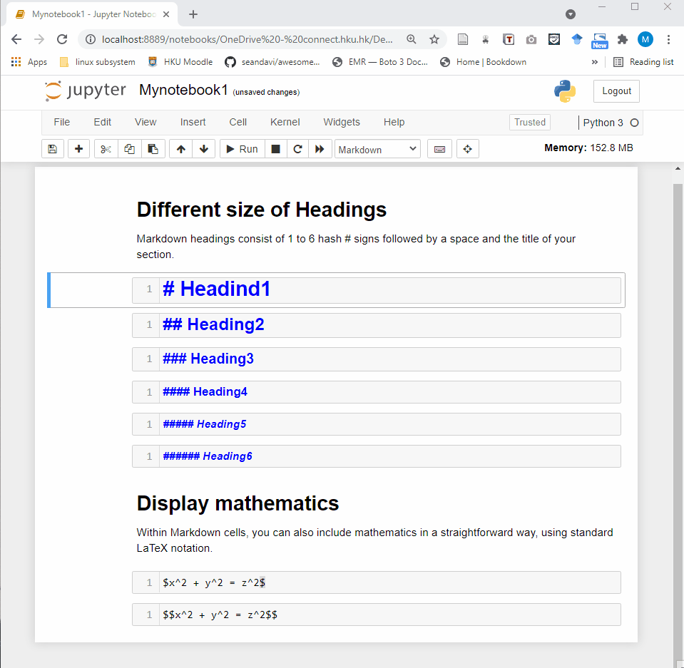
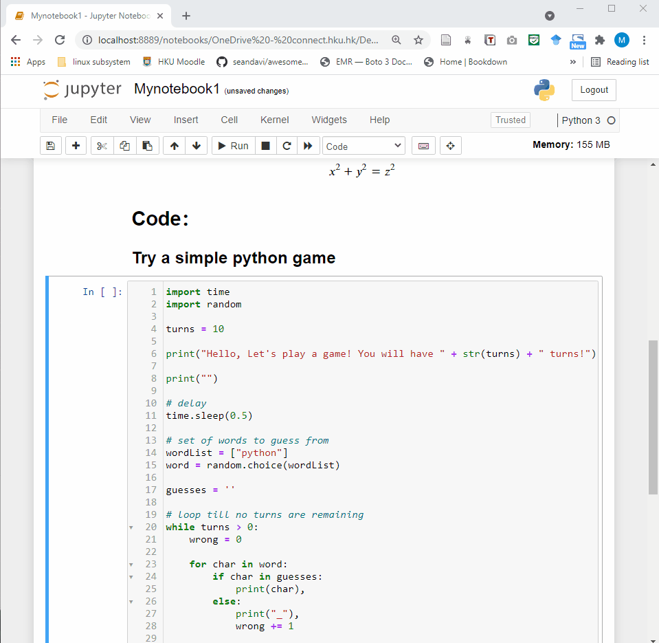
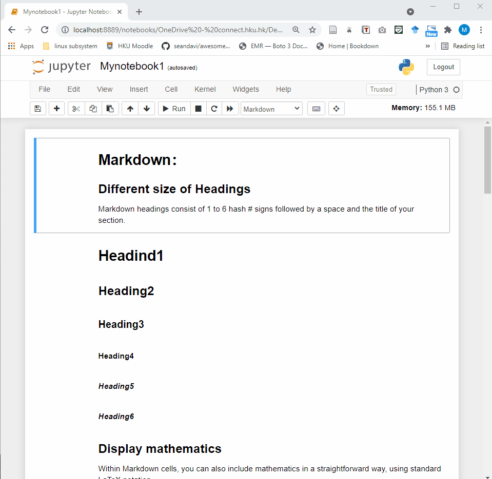

--- 
title: " "


link-citations: yes
description: "This is an introduction of R."
output:
  html_document
---

# Introduction to Jupyter Notebook

Xiunan Fang, Junyi Chen, Joshua Ho

Last update: 2021-09-02

Contact: jwkho@hku.hk

Jupyter is a project developed for interactive computation for different programming languages such as Python, R, Julia, JavaScript and so on. The Jupyter Notebook is an web application which is useful for creating documents with live codes, visualizations, and narrative text (Markdown). 

```{r fig1, echo=FALSE, message=FALSE, warning=FALSE}
knitr::include_graphics("./images/labpreview.png")
```

# Start

## Online access

### Load an online Jupyter noteboook
You can simply use Jupyter notebook through the [Jupyter website](https://jupyter.org/).
Click on the ["Try it in your browswer"](https://jupyter.org/try) buttom and you can click on "Try Classic Notebook" and you will see the loading page and open a Jupyter notebook.

You can create a new script by:

`` File –> New Notebook –> Python3``


```{r fig2, echo=FALSE, message=FALSE, warning=FALSE}
knitr::include_graphics("./images/open.gif")
```

### Jupyter Notebook from Jupyter Lab
You can also launch a notebook from jupyter lab. Compared with the Jupyter notebook, JupyterLab is more of an IDE(Integrated Development Environment)-like experience. The classic Jupyter Notebook only consists of a file browser and an editor view and JupyterLab contains more features and provides useful widgets.
```{r fig3, echo=FALSE, message=FALSE, warning=FALSE}
knitr::include_graphics("./images/openlab.gif")
```

## Jupyter on your computer

Jupyter runs codes for many languages, while Python is a requirement. Jupyter Notebook contains basic Scientific Computing and Data Science packages. For simplicity, you can install Python and Jupyter using Anaconda, you can follow the Anaconda instruction in their website.

**Install on** [Windows](https://docs.anaconda.com/anaconda/install/windows/)

**Install on** [Mac](https://docs.anaconda.com/anaconda/install/mac-os/)

**Install on** [Linux](https://docs.anaconda.com/anaconda/install/linux/)

# Jupyter Notebook Overview

## Interface

Jupyter Notebook provides a very simple and user-friendly interface, including Menu bar, Toolbar and Cell. A notebook consists of a sequence of cells. There are three types of cells in Jupyter Notebook.
```{r fig4, echo=FALSE, message=FALSE, warning=FALSE}
knitr::include_graphics("./images/cell.gif")
```

- Raw Cell:
Raw cells provide a place where you can write anything that you don't want to be executed by the notebook. 

- Markdown Cell:
Markdown cells can be executed and provides documentations for your notebook.

```{r fig5, echo=FALSE, message=FALSE, warning=FALSE}

```

- Code cell:
A code cell allows you to edit and write new code. When executed, the code is sent to the kernel associated with the notebook. The execution results are returned and displayed in the notebook as the cell’s output. 

```{r fig6, echo=FALSE, message=FALSE, warning=FALSE}

```

## Shortcuts

- `Shift + Enter` run the current cell, select below
- `Ctrl + Enter` run selected cells
- `Alt + Enter` run the current cell, insert below
- `Ctrl + S` save and checkpoint

***command mode (press Esc to activate):***

- `Enter` take you into edit mode
- `H` show all shortcuts
- `Up` select cell above
- `Down` select cell below
- `Shift + Up` extend selected cells above 
- `Shift + Down` extend selected cells below
- `A` insert cell above
- `B` insert cell below
- `X` cut selected cells
- `C` copy selected cells
- `V` paste cells below
- `Shift + V` paste cells above
- `D`, `DD` delete selected cells
- `Z` undo cell deletion
- `S` Save and Checkpoint
- `Y` change the cell type to Code
- `M` change the cell type to Markdown
- `P` open the command palette.

You can check the keyboard shortcuts by：

`` Help –> Keyboard Shortcuts``

```{r fig7, echo=FALSE, message=FALSE, warning=FALSE}

```

# Covid19 analysis with Python(Needs to be modified)
Let's go though an analysis using covid19 data in Jupyter notebook. You can find the notebook in (https://nbviewer.jupyter.org/github/Dhruv-praju/COVID-19-Tracker/blob/main/India/Indian_Complete_COVID-19_Analysis.ipynb).

```{r fig8, echo=FALSE, message=FALSE, warning=FALSE}
knitr::include_graphics("./images/covid.png")
```


